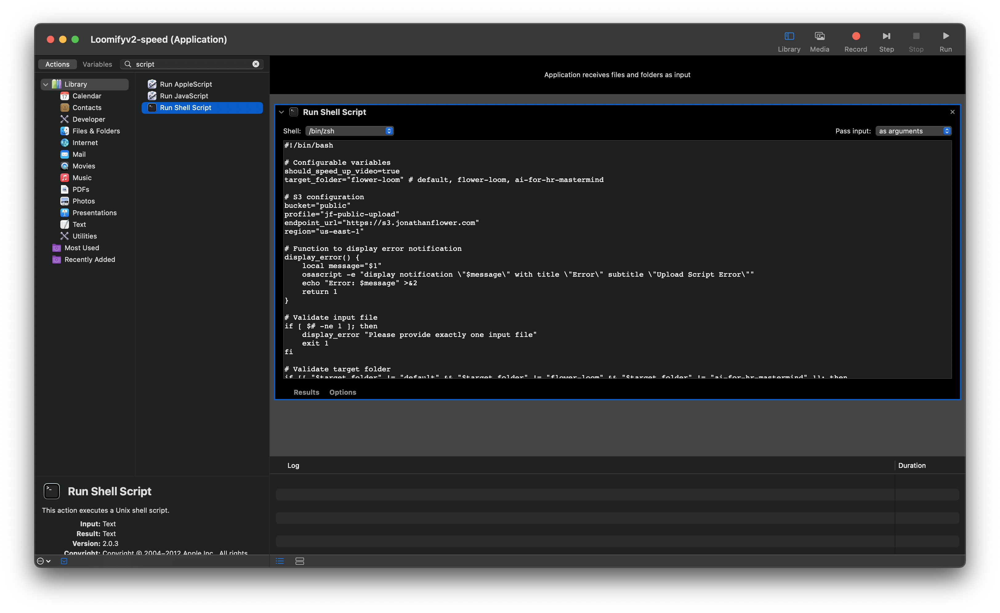

# Loom Style Video Upload Utility

I love Loom.  I use it all the time to communicate with my team and stakeholders.  However, the price point is a bit high and really the only feature I want is to speed up the video 1.4x.  So, I created a similar tool that I don't have to pay for.  

Drag a video onto the droplet, it will be speed up the video 1.4x (Loom style), uploaded to an S3-compatible storage, and copy the URL to your clipboard for easy sharing. 

## Who is this for?

It is for people who are comfortable with a very small amount of coding and want to upload videos to an S3-compatible storage that are speed up 1.4x.  

## Features

- Upload videos to S3-compatible storage (MinIO, AWS S3, etc.)
- Optional video speed adjustment using FFmpeg
- Automatic content-type detection (for streaming)
- macOS notifications for upload status
- URL copying to clipboard after successful upload

## Prerequisites

- macOS
- Homebrew
- AWS CLI (`brew install awscli`)
- FFmpeg (`brew install ffmpeg`) - required only for video speed adjustment
- an S3-compatible storage bucket with two policies: one for public read access and one for private write access

## How to use
1. setup your AWS credentials with write access to the bucket
    - `aws configure --profile jf-public-upload`
2. update the upload_script.sh with if you want it sped up or not, bucket, folder, profile, region, and endpoint_url
3. Open Automator
4. Create a new Application
5. select the "Run Shell Script" action
6. copy the bash script into Automator.
7. save the application
8. drag a video onto the application icon and it will upload it.
9. (optionally) create multiple applications for different target folders and settings.

Alternatively, you can run the bash script directly: `./upload_script.sh <file_path>`

## Automator App
This is what it looks like in Automator.  Notice the app on my desktop.  I can drag files onto it and it will upload them.

## FYI
I am using a Synology DSM with MinIO for the S3-compatible storage.  This makes this solution a bit more complex, but it is completely free for me to operate and the uploads are over LAN which makes them very fast.  

If my videos get a lot of traffic, I plan to add a CDN via Cloudflare to the mix.

## Great Video Recording Applications

- [Screenity](https://screenity.io/en/): A powerful screen recording tool with annotation features. *(Free)*
- [Komodo Decks](https://komododecks.com/): A collaborative video recording platform for teams. *(Paid)*
- [Veed.io](https://www.veed.io/): An online video editing and recording tool with various features. *(Paid)*
- [OBS Studio](https://obsproject.com/): A free and open-source software for video recording and live streaming. *(Free)*
- Quicktime: Built into macOS, Quicktime offers basic video recording and editing capabilities. *(Free)*