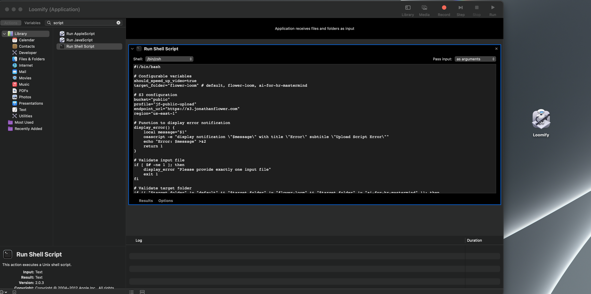

# Loom Style Video Upload Utility

A command-line utility for uploading and processing video files to S3-compatible storage, with optional speed adjustment (similar to Loom)

## Features

- Upload videos to S3-compatible storage (MinIO, AWS S3, etc.)
- Optional video speed adjustment using FFmpeg
- Automatic content-type detection
- macOS notifications for upload status
- URL copying to clipboard after successful upload
- Support for multiple target folders

## Prerequisites

- macOS
- Homebrew
- AWS CLI (`brew install awscli`)
- FFmpeg (`brew install ffmpeg`) - required only for video speed adjustment

## How to use
1. run the bash script: `./upload_script.sh <file_path>`
2. copy the bash script into an Automator Application.  This is prefered because it helps turn the bash script into a MacOs app that you can drag files onto.  

## Automator App
This is what it looks like in Automator.  Notice the app on my desktop.  I can drag files onto it and it will upload them.

